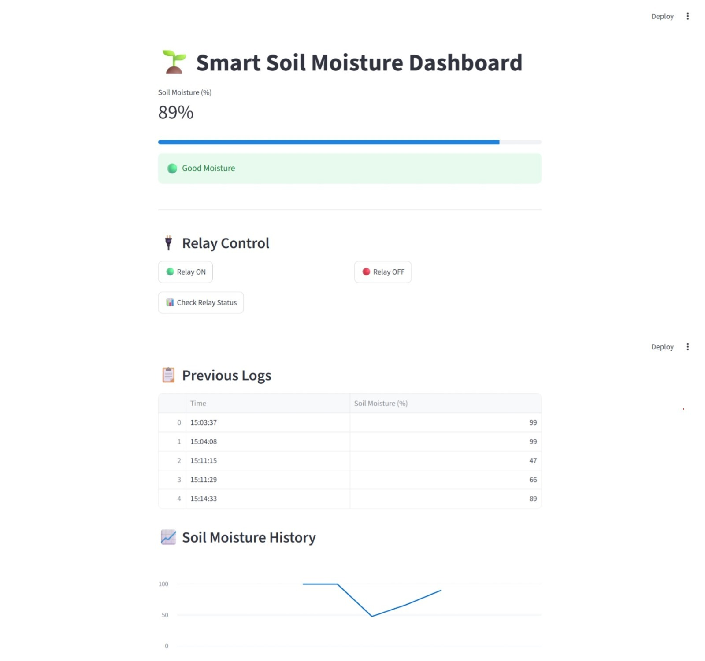
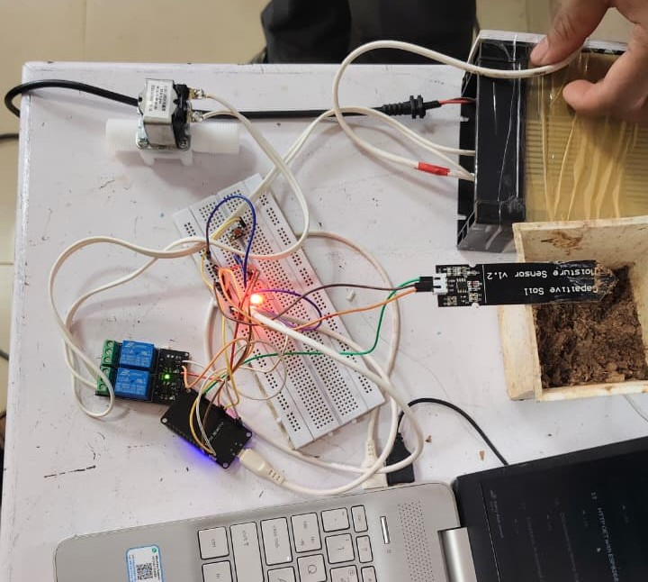

# Final Firmware Report – Automated Grow Bench Project

## Intern Details

**Name:** Eldho Raj
**Branch:** Electronics and Communication Engineering
**Platform:** Arduino IDE
**Project:** Smart Grow Bench Irrigation System

---

## Repository

**GitHub Repository:** `zelbytes-arduino`

---

# 1. Project Overview

This project implements an automated grow-bench irrigation system using an ESP32 microcontroller. The system continuously monitors soil moisture and automatically controls irrigation through a relay-driven solenoid valve.

Main objectives:

* Monitor soil moisture in real time
* Automatically irrigate when soil becomes dry
* Allow manual override using button and commands
* Upload telemetry to cloud server
* Enable remote browser-based control

---

# 2. Hardware Bill of Materials (BOM)

| Component             | Quantity | Purpose              |
| --------------------- | -------: | -------------------- |
| ESP32 Dev Board       |        1 | Main controller      |
| Soil Moisture Sensor  |        1 | Detect soil moisture |
| Relay Module          |        1 | Controls valve       |
| Solenoid Valve        |        1 | Water flow control   |
| Push Button           |        1 | Manual override      |
| LED                   |        1 | Status indicator     |
| 220Ω Resistor         |        1 | LED protection       |
| Jumper Wires          | Multiple | Connections          |
| External Power Supply |        1 | Valve power          |

---

# 3. Hardware Architecture

The system consists of sensor, control, and actuation layers.

## Sensor Layer

The soil moisture sensor continuously measures moisture level and sends analog values to ESP32.

## Control Layer

ESP32 processes sensor data and compares it with the threshold to decide irrigation state.

## Actuation Layer

Relay controls the solenoid valve to start or stop irrigation.

## Dashboard Interface

The dashboard displays soil moisture telemetry and system status.



## Hardware Prototype

Physical hardware setup of the grow bench.



---

# 4. Wiring Diagram

## Soil Sensor

* VCC → 3.3V
* GND → GND
* AO → GPIO34

## Relay Module

* VCC → 5V
* GND → GND
* IN → GPIO26

## Push Button

* One side → GPIO27
* Other side → GND
* Uses `INPUT_PULLUP`

## LED

* Anode → GPIO2 via 220Ω resistor
* Cathode → GND

## Solenoid Valve

* Valve + → External Supply +
* Valve − → Relay NO
* Relay COM → Supply −

---

# 5. Methodology

The Smart Grow Bench system was developed by first assembling the hardware components and connecting them to the ESP32. Firmware was then written in Arduino IDE to read soil moisture values and control irrigation automatically. The soil sensor was calibrated under dry and wet conditions to determine a suitable threshold. Manual override, telemetry upload, and web control features were implemented. Finally, the system was tested under multiple conditions to verify correct operation.

---

# 6. Firmware Features

## Automatic Irrigation

When soil becomes dry, irrigation turns ON automatically.

Threshold:

```cpp
const int DRY_THRESHOLD = 2000;
```

Logic:

* Above threshold → Valve ON
* Below threshold → Valve OFF

## Manual Override

Button allows manual control of valve.

## Serial Commands

Supported commands:

```text
STATUS
FORCE_ON
FORCE_OFF
```

## Web Server Endpoints

```text
/on
/off
/status
```

## Telemetry Upload

Uploaded JSON:

```json
{
  "soil_moisture_pct": 52
}
```

Upload interval:

* Every 3 seconds

---

# 7. Calibration Methodology

Calibration was performed under two soil conditions.

## Dry Soil

Observed value:

```text
1500
```

## Wet Soil

Observed value:

```text
2069
```

Chosen threshold:

```text
2000
```

Decision:

* Above 2000 → Dry
* Below 2000 → Wet

---

# 8. Control Logic

System workflow:

1. Read soil sensor
2. Convert to percentage
3. Check button state
4. Process auto/manual mode
5. Control relay and LED
6. Read serial commands
7. Upload telemetry
8. Wait 3 seconds

Pseudo flow:

```text
Read Sensor
   ↓
Check Mode
   ↓
AUTO → Compare Threshold
MANUAL → Keep State
   ↓
Control Relay
   ↓
Upload Telemetry
```

---

# 9. Test Results

## Test 1 – Sensor Reading

PASS
Sensor values read successfully.

## Test 2 – Automatic Irrigation

PASS
Relay activated when threshold crossed.

## Test 3 – Manual Override

PASS
Button toggled valve correctly.

## Test 4 – Serial Commands

PASS
All commands worked.

## Test 5 – Telemetry Upload

Observed HTTP response:

```text
202
```

PASS
Server accepted data.

## Test 6 – LED Status

PASS
LED reflected valve state.

---

# 10. Known Limitations

## Sensor Noise

Values fluctuate near threshold.

## Relay Delay

Mechanical relay has switching delay.

## Button Debounce

Current debounce:

```cpp
delay(300);
```

## Wi-Fi Dependency

Cloud telemetry stops without internet.

## Security

Wi-Fi credentials are hardcoded.

---

# 11. Power Considerations

* ESP32 logic: 3.3V
* Relay: 5V
* Valve: External supply

Important:
Never power solenoid valve directly from ESP32 GPIO.

---

# 12. Reflash Instructions for Next Intern

## Required Software

* Arduino IDE
* ESP32 board package

## Required Libraries

* WiFi
* HTTPClient
* WebServer

## Board Setting

```text
ESP32 Dev Module
```

## Upload Steps

1. Connect ESP32 via USB
2. Open Arduino IDE
3. Load `.ino` file
4. Check credentials
5. Select board & port
6. Upload
7. Open Serial Monitor at:

```text
115200 baud
```

Expected output:

```text
WiFi Connected
ESP32 IP Address: ...
Web Server Started
```

---

# 13. Future Improvements

Possible upgrades:

* OTA updates
* Better sensor
* Mobile app
* Historical graphs
* Multiple irrigation zones

---

# 14. Conclusion

The Smart Grow Bench Irrigation System successfully achieved automated irrigation using ESP32 and soil moisture sensing. The system supports automatic control, manual override, telemetry upload, and web-based monitoring. The firmware is stable and ready for future improvements in smart agriculture applications.
